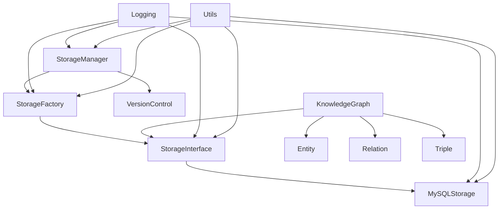
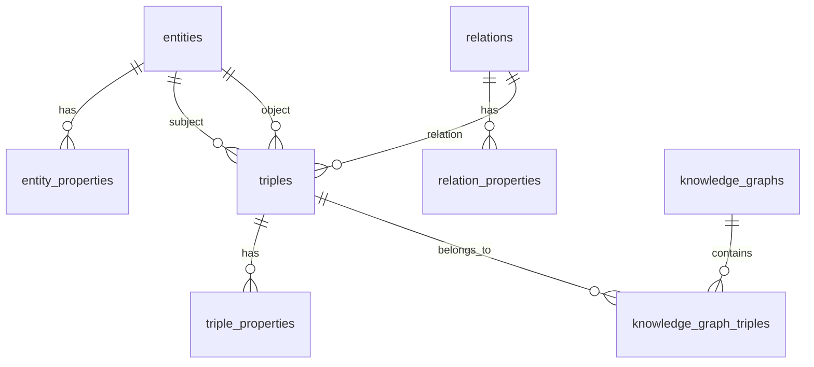

# 知识图谱系统模块设计文档

## 1. 存储模块 (Storage)

### 1.1 存储接口 (StorageInterface)
**位置**: `include/storage/storage_interface.h`

#### 功能概述
定义了存储模块的基础接口，提供了知识图谱数据的持久化操作。

#### 核心功能
1. **基础操作**
   - 初始化存储连接
   - 关闭存储连接
   - 检查连接状态
   - 创建/更新数据库架构

2. **实体管理**
   - 保存实体
   - 加载实体
   - 查询实体
   - 删除实体
   - 批量保存实体

3. **关系管理**
   - 保存关系
   - 加载关系
   - 查询关系
   - 删除关系
   - 批量保存关系

4. **三元组管理**
   - 保存三元组
   - 加载三元组
   - 查询三元组
   - 删除三元组
   - 批量保存三元组

5. **知识图谱管理**
   - 保存知识图谱
   - 加载知识图谱
   - 删除知识图谱
   - 列出所有知识图谱

6. **事务管理**
   - 开始事务
   - 提交事务
   - 回滚事务

### 1.2 MySQL存储实现 (MySQLStorage)
**位置**: `src/storage/mysql_storage.cpp`

#### 功能特点
1. **连接管理**
   - 支持连接字符串配置
   - 自动重连机制
   - 连接状态监控
   - 连接信息脱敏

2. **预处理语句**
   - 预编译SQL语句
   - 参数化查询
   - 批量操作优化

3. **事务处理**
   - ACID特性保证
   - 自动事务管理
   - 死锁检测

4. **错误处理**
   - 详细的错误日志
   - 异常状态恢复
   - 错误信息追踪

### 1.3 存储工厂 (StorageFactory)
**位置**: `include/storage/storage_factory.h`

#### 功能概述
提供存储适配器的创建和管理功能。

#### 核心功能
1. **存储类型注册**
   - 注册新的存储类型
   - 获取已注册的存储类型
   - 验证存储类型

2. **存储实例创建**
   - 根据类型创建存储实例
   - 配置存储参数
   - 实例生命周期管理

## 2. 知识图谱模块 (Knowledge)

### 2.1 实体 (Entity)
**位置**: `include/knowledge/entity.h`

#### 功能概述
表示知识图谱中的实体节点。

#### 核心功能
1. **基本信息管理**
   - 实体ID
   - 实体名称
   - 实体类型
   - 属性管理

2. **属性操作**
   - 添加属性
   - 获取属性
   - 删除属性
   - 属性查询

### 2.2 关系 (Relation)
**位置**: `include/knowledge/relation.h`

#### 功能概述
定义实体之间的关系类型。

#### 核心功能
1. **关系类型定义**
   - 关系ID
   - 关系名称
   - 关系类型
   - 反向关系
   - 对称性

2. **关系属性管理**
   - 属性添加
   - 属性获取
   - 属性删除
   - 属性查询

### 2.3 三元组 (Triple)
**位置**: `include/knowledge/triple.h`

#### 功能概述
表示知识图谱中的基本知识单元。

#### 核心功能
1. **三元组结构**
   - 主体实体
   - 关系
   - 客体实体
   - 置信度

2. **属性管理**
   - 属性添加
   - 属性获取
   - 属性删除
   - 属性查询

### 2.4 知识图谱 (KnowledgeGraph)
**位置**: `include/knowledge/knowledge_graph.h`

#### 功能概述
管理整个知识图谱的结构和操作。

#### 核心功能
1. **图谱管理**
   - 图谱创建
   - 图谱命名
   - 图谱描述
   - 图谱版本

2. **三元组管理**
   - 添加三元组
   - 删除三元组
   - 查询三元组
   - 批量操作

3. **实体管理**
   - 实体添加
   - 实体查询
   - 实体删除
   - 实体关系分析

4. **关系管理**
   - 关系添加
   - 关系查询
   - 关系删除
   - 关系分析

## 3. 版本控制模块 (VersionControl)

### 3.1 版本控制 (VersionControl)
**位置**: `include/storage/version_control.h`

#### 功能概述
管理知识图谱的版本历史。

#### 核心功能
1. **版本管理**
   - 版本创建
   - 版本回滚
   - 版本比较
   - 版本历史

2. **存储管理**
   - 版本存储
   - 版本加载
   - 版本清理
   - 存储优化

3. **元数据管理**
   - 版本信息
   - 时间戳
   - 作者信息
   - 变更说明

## 4. 存储管理模块 (StorageManager)

### 4.1 存储管理器 (StorageManager)
**位置**: `include/storage/storage_manager.h`

#### 功能概述
统一管理存储适配器和版本控制。

#### 核心功能
1. **存储管理**
   - 存储类型注册
   - 存储实例创建
   - 存储配置管理
   - 存储状态监控

2. **版本控制集成**
   - 版本系统初始化
   - 版本操作封装
   - 版本状态管理
   - 版本同步

3. **系统配置**
   - 配置加载
   - 配置验证
   - 配置更新
   - 配置持久化

## 5. 日志模块 (Logging)

### 5.1 日志系统
**位置**: `include/common/logging.h`

#### 功能概述
提供系统级的日志记录功能。

#### 核心功能
1. **日志级别**
   - DEBUG
   - INFO
   - WARN
   - ERROR
   - FATAL

2. **日志功能**
   - 日志记录
   - 日志过滤
   - 日志轮转
   - 日志查询

3. **日志格式**
   - 时间戳
   - 日志级别
   - 模块信息
   - 详细信息

## 6. 工具模块 (Utils)

### 6.1 工具类
**位置**: `include/common/utils.h`

#### 功能概述
提供通用的工具函数。

#### 核心功能
1. **字符串处理**
   - 字符串分割
   - 字符串转换
   - 字符串格式化
   - 字符串验证

2. **文件操作**
   - 文件读写
   - 文件路径处理
   - 文件权限管理
   - 文件监控

3. **系统工具**
   - 时间处理
   - 内存管理
   - 系统信息
   - 性能监控

## 模块间关系

## 设计特点

1. **模块化设计**
   - 高内聚低耦合
   - 接口清晰
   - 易于扩展

2. **可维护性**
   - 完整的日志系统
   - 统一的错误处理
   - 清晰的代码结构

3. **可扩展性**
   - 工厂模式
   - 接口抽象
   - 插件化设计

4. **性能优化**
   - 连接池
   - 预处理语句
   - 批量操作

5. **安全性**
   - 参数化查询
   - 事务管理
   - 错误处理

## 注意事项

1. 模块间依赖关系需要严格控制
2. 接口设计需要考虑向后兼容性
3. 错误处理需要统一且完整
4. 日志记录需要完整且有意义
5. 性能优化需要持续关注

---

# 知识图谱数据库设计文档

## 1. 实体表 (entities)

### 用途
存储知识图谱中的实体信息，包括实体ID、名称和类型。

### 字段说明
| 字段名 | 类型 | 长度 | 是否可空 | 默认值 | 说明 |
|--------|------|------|----------|--------|------|
| id | VARCHAR | 100 | 否 | - | 实体唯一标识符，主键 |
| name | TEXT | - | 否 | - | 实体名称 |
| type | INT | - | 否 | - | 实体类型（枚举值） |
| created_at | TIMESTAMP | - | 是 | CURRENT_TIMESTAMP | 创建时间 |
| updated_at | TIMESTAMP | - | 是 | CURRENT_TIMESTAMP ON UPDATE CURRENT_TIMESTAMP | 更新时间 |

### 索引
- 主键索引：`id`
- 普通索引：`idx_entity_name` (SUBSTRING(name, 1, 100))
- 普通索引：`idx_entity_type` (type)

## 2. 实体属性表 (entity_properties)

### 用途
存储实体的属性信息，支持动态属性。

### 字段说明
| 字段名 | 类型 | 长度 | 是否可空 | 默认值 | 说明 |
|--------|------|------|----------|--------|------|
| entity_id | VARCHAR | 100 | 否 | - | 关联的实体ID，外键 |
| key | VARCHAR | 100 | 否 | - | 属性键名 |
| value | TEXT | - | 否 | - | 属性值 |
| created_at | TIMESTAMP | - | 是 | CURRENT_TIMESTAMP | 创建时间 |
| updated_at | TIMESTAMP | - | 是 | CURRENT_TIMESTAMP ON UPDATE CURRENT_TIMESTAMP | 更新时间 |

### 索引
- 主键索引：`(entity_id, key)`
- 外键索引：`entity_id` 关联 `entities(id)`
- 普通索引：`idx_entity_property_key` (key)

## 3. 关系表 (relations)

### 用途
存储知识图谱中的关系类型信息。

### 字段说明
| 字段名 | 类型 | 长度 | 是否可空 | 默认值 | 说明 |
|--------|------|------|----------|--------|------|
| id | VARCHAR | 100 | 否 | - | 关系唯一标识符，主键 |
| name | TEXT | - | 否 | - | 关系名称 |
| type | INT | - | 否 | - | 关系类型（枚举值） |
| inverse_name | TEXT | - | 否 | - | 反向关系名称 |
| is_symmetric | BOOLEAN | - | 否 | FALSE | 是否对称关系 |
| created_at | TIMESTAMP | - | 是 | CURRENT_TIMESTAMP | 创建时间 |
| updated_at | TIMESTAMP | - | 是 | CURRENT_TIMESTAMP ON UPDATE CURRENT_TIMESTAMP | 更新时间 |

### 索引
- 主键索引：`id`
- 普通索引：`idx_relation_name` (SUBSTRING(name, 1, 100))
- 普通索引：`idx_relation_type` (type)

## 4. 关系属性表 (relation_properties)

### 用途
存储关系的属性信息，支持动态属性。

### 字段说明
| 字段名 | 类型 | 长度 | 是否可空 | 默认值 | 说明 |
|--------|------|------|----------|--------|------|
| relation_id | VARCHAR | 100 | 否 | - | 关联的关系ID，外键 |
| key | VARCHAR | 100 | 否 | - | 属性键名 |
| value | TEXT | - | 否 | - | 属性值 |
| created_at | TIMESTAMP | - | 是 | CURRENT_TIMESTAMP | 创建时间 |
| updated_at | TIMESTAMP | - | 是 | CURRENT_TIMESTAMP ON UPDATE CURRENT_TIMESTAMP | 更新时间 |

### 索引
- 主键索引：`(relation_id, key)`
- 外键索引：`relation_id` 关联 `relations(id)`
- 普通索引：`idx_relation_property_key` (key)

## 5. 三元组表 (triples)

### 用途
存储知识图谱中的三元组信息，连接实体和关系。

### 字段说明
| 字段名 | 类型 | 长度 | 是否可空 | 默认值 | 说明 |
|--------|------|------|----------|--------|------|
| id | VARCHAR | 100 | 否 | - | 三元组唯一标识符，主键 |
| subject_id | VARCHAR | 100 | 否 | - | 主体实体ID，外键 |
| relation_id | VARCHAR | 100 | 否 | - | 关系ID，外键 |
| object_id | VARCHAR | 100 | 否 | - | 客体实体ID，外键 |
| confidence | FLOAT | - | 否 | 1.0 | 置信度 |
| created_at | TIMESTAMP | - | 是 | CURRENT_TIMESTAMP | 创建时间 |
| updated_at | TIMESTAMP | - | 是 | CURRENT_TIMESTAMP ON UPDATE CURRENT_TIMESTAMP | 更新时间 |

### 索引
- 主键索引：`id`
- 唯一索引：`idx_unique_triple` (subject_id, relation_id, object_id)
- 外键索引：`subject_id` 关联 `entities(id)`
- 外键索引：`relation_id` 关联 `relations(id)`
- 外键索引：`object_id` 关联 `entities(id)`
- 普通索引：`idx_triple_subject` (subject_id)
- 普通索引：`idx_triple_relation` (relation_id)
- 普通索引：`idx_triple_object` (object_id)
- 普通索引：`idx_triple_confidence` (confidence)

## 6. 三元组属性表 (triple_properties)

### 用途
存储三元组的属性信息，支持动态属性。

### 字段说明
| 字段名 | 类型 | 长度 | 是否可空 | 默认值 | 说明 |
|--------|------|------|----------|--------|------|
| triple_id | VARCHAR | 100 | 否 | - | 关联的三元组ID，外键 |
| key | VARCHAR | 100 | 否 | - | 属性键名 |
| value | TEXT | - | 否 | - | 属性值 |
| created_at | TIMESTAMP | - | 是 | CURRENT_TIMESTAMP | 创建时间 |
| updated_at | TIMESTAMP | - | 是 | CURRENT_TIMESTAMP ON UPDATE CURRENT_TIMESTAMP | 更新时间 |

### 索引
- 主键索引：`(triple_id, key)`
- 外键索引：`triple_id` 关联 `triples(id)`
- 普通索引：`idx_triple_property_key` (key)

## 7. 知识图谱表 (knowledge_graphs)

### 用途
存储知识图谱的基本信息。

### 字段说明
| 字段名 | 类型 | 长度 | 是否可空 | 默认值 | 说明 |
|--------|------|------|----------|--------|------|
| name | VARCHAR | 100 | 否 | - | 知识图谱名称，主键 |
| description | TEXT | - | 是 | - | 知识图谱描述 |
| created_at | TIMESTAMP | - | 是 | CURRENT_TIMESTAMP | 创建时间 |
| updated_at | TIMESTAMP | - | 是 | CURRENT_TIMESTAMP ON UPDATE CURRENT_TIMESTAMP | 更新时间 |

### 索引
- 主键索引：`name`

## 8. 知识图谱三元组关联表 (knowledge_graph_triples)

### 用途
存储知识图谱与其包含的三元组之间的关联关系。

### 字段说明
| 字段名 | 类型 | 长度 | 是否可空 | 默认值 | 说明 |
|--------|------|------|----------|--------|------|
| graph_name | VARCHAR | 100 | 否 | - | 知识图谱名称，外键 |
| triple_id | VARCHAR | 100 | 否 | - | 三元组ID，外键 |
| created_at | TIMESTAMP | - | 是 | CURRENT_TIMESTAMP | 创建时间 |

### 索引
- 主键索引：`(graph_name, triple_id)`
- 外键索引：`graph_name` 关联 `knowledge_graphs(name)`
- 外键索引：`triple_id` 关联 `triples(id)`

## 表关系图

## 设计特点

1. **灵活性**
   - 支持动态属性（通过属性表）
   - 支持多种实体和关系类型
   - 支持多个知识图谱共存

2. **性能优化**
   - 合理的索引设计
   - 使用预处理语句
   - 支持事务处理

3. **数据完整性**
   - 使用外键约束
   - 唯一性约束
   - 级联删除

4. **可追踪性**
   - 记录创建和更新时间
   - 支持版本控制

5. **安全性**
   - 参数化查询防止SQL注入
   - 敏感信息脱敏处理

## 注意事项

1. 所有表使用 InnoDB 引擎，支持事务和外键
2. 字符集使用 utf8mb4，支持完整的 Unicode 字符
3. 时间字段自动维护，无需手动更新
4. 主键使用 VARCHAR 类型，支持自定义ID
5. 属性表设计支持动态扩展，无需修改表结构
